#### Anexo 2: Pantallas de la App

##### Pantallas generales

La aplicacion tiene varias 3 pantallas principales, como son `pacientes`, `estadisticas` y `perfil`, a parte de la pagina de login que solo veremos la primera vez que nos logueemos.

<table>
<thead><tr><td><strong>Pantalla</strong></td><td><strong>Comentario</strong></td></tr></thead>
<tbody>
    <tr>
        <td>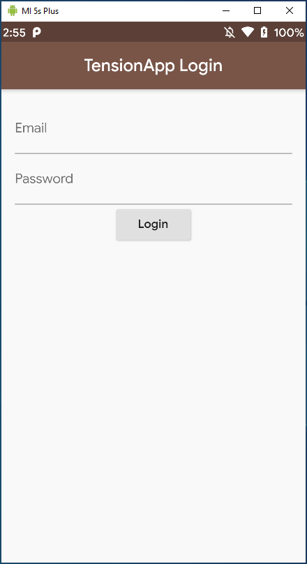</td>
        <td valign="top"><strong>Pantalla de login</strong> Para poder acceder al sistema, el médico debera hacer login en el sistema. <small><i>(A dia de hoy la unica forma de generar un usuario es mediante una llamada a la API, via postman, explicada en la parte del server.)</i></small></td>
    </tr>
    <tr>
        <td>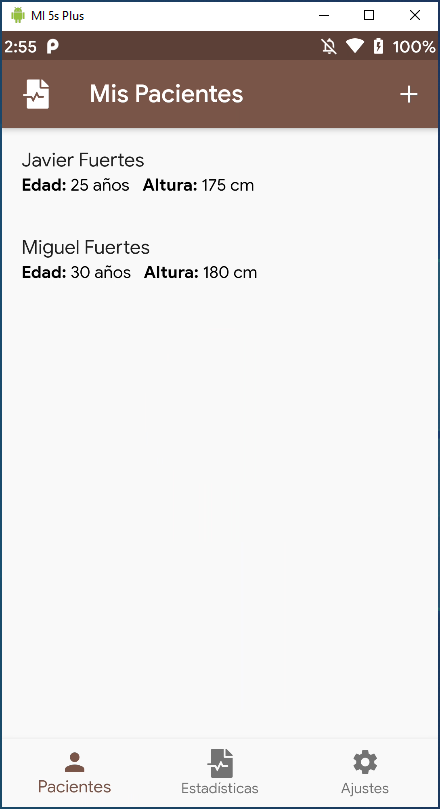</td>
        <td valign="top"><strong>Pantalla de Pacientes</strong> Nad mas entrar en la aplicacion se nos presenta esta pantalla. Aqui veremos nuestros pacientes y podremos, clicando sobre ellos, consultar el historico de las medidas asi como realizar nuevas mediciones.</td>
    </tr>
    <tr>
        <td>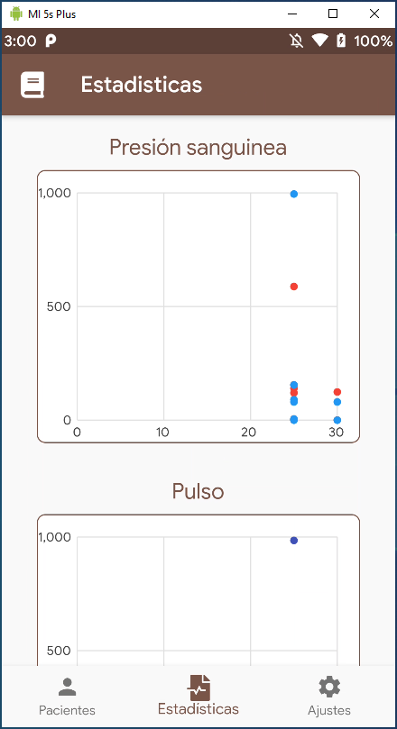</td>
        <td valign="top"><strong>Pantalla de Estadisticas</strong> La segunda pestaña que nos encontramos es la de estadistica. Aqui se cargaran todos los datos numericos de todos los pacientes de todos los medicos en forma de grafica.</td>
    </tr>
    <tr>
        <td>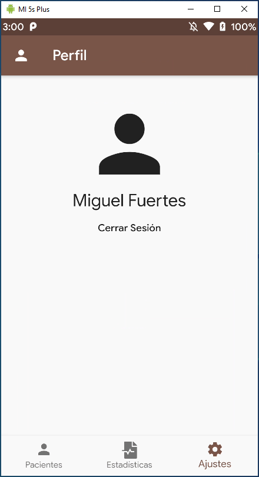</td>
        <td valign="top"><strong>Pantalla de Perfil</strong> La tercera pestaña es la del perfil de usuario. Aqui se encuentrasn todas las configuraciones de la plataforma asi como los datos privados de los médicos, nombre, apellidos, contraseña, etc.</td>
    </tr>
</tbody>
</table>

##### Pantallas de Medición

Si nos centramos en la pantalla de pacientes y entramos en su historico podremos introducir nuevas mediciones de peso, presion y pulso.

<table>
<thead><tr><td><strong>Pantalla</strong></td><td><strong>Comentario</strong></td></tr></thead>
<tbody>
    <tr>
        <td>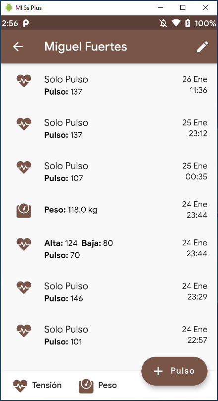</td>
        <td valign="top"><strong>Pantalla de historico de Paciente</strong> Al seleccionar un paciente de la lista de pacientes llegaremos a esta pantalla. Aquí podemos ver las ultimas mediciones, asi como realizar nuevas.</td>
    </tr>
    <tr>
        <td>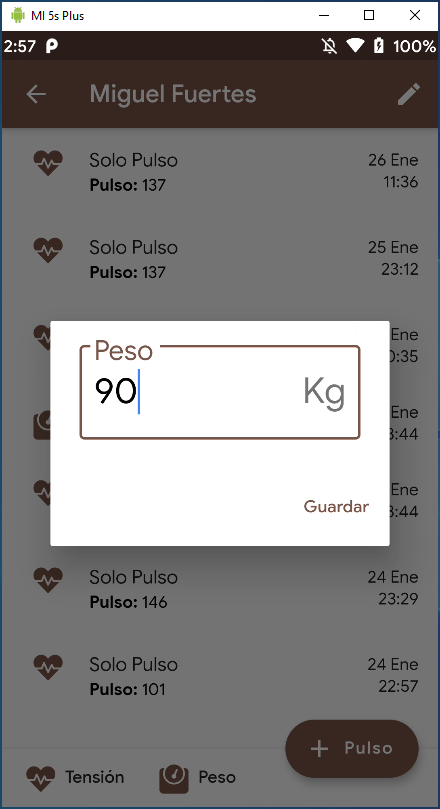</td>
        <td valign="top"><strong>Pantalla de introduccion de peso</strong> Pulsando sobre el boton <strong><i>Peso</i></strong> se nos desplegara un dialogo para introducir la medida. </td>
    </tr>
    <tr>
        <td>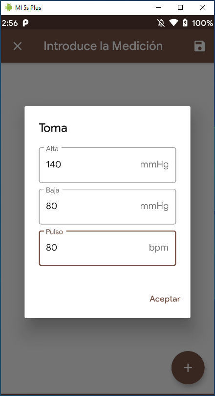</td>
        <td valign="top"><strong>Pantalla de introduccion de tension</strong> Pulsando sobre el boton <strong><i>Tensión</i></strong> se nos desplegara un dialogo para introducir la medida.  En este caso podemos introducir mas de una toma, simplemente dandole al boton "<strong><i>+</i></strong>"</td>
    </tr>
    <tr>
        <td>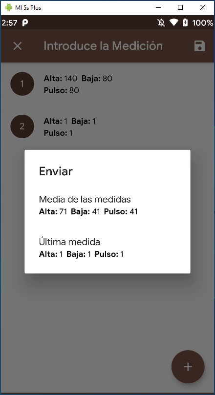</td>
        <td valign="top"><strong>Pantalla de envio de tension</strong> Cuando tengamos todas las tomas deseadas, simplemente las enviamos dandole al boton de guardar.  Se nos abrira un cuadro de dialogo preguntando que queremos enviar, si la media o la ultima.</td>
    </tr>
    <tr>
        <td>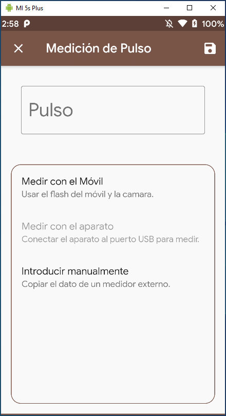</td>
        <td valign="top"><strong>Pantalla de introducción de pulso</strong> Pulsando sobre el boton <strong><i>Pulso</i></strong> se nos desplegara una para seleccionar como queremos introducir la medida. Podra ser manual, utilizando el flash y la camara del movil, o mediante un aparato conectado al USB del movil.  Una vez tengamos la medida, simplemente le damos a guardar. 
        <small><i>(Actualemente la opcion USB esta por desarrollar) 
        (La opcion de flash + camara solo esta disponible para Android)</i></small></td>
    </tr>
    <tr>
        <td>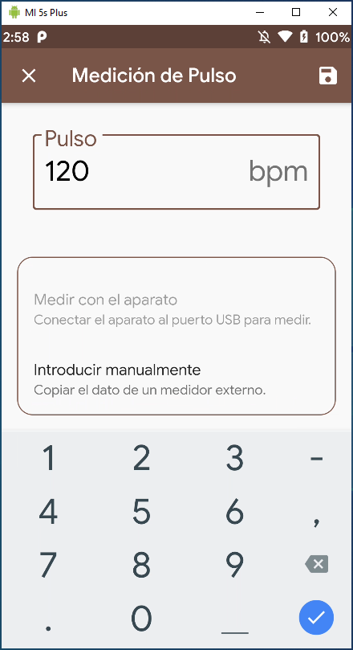</td>
        <td valign="top"><strong>Pantalla de introducción de pulso</strong> Pulsando sobre el boton <strong><i>introducir manualmente</i></strong> se activara el campo de texto y podremos introducri la medida.</td>
    </tr>
    <tr>
        <td>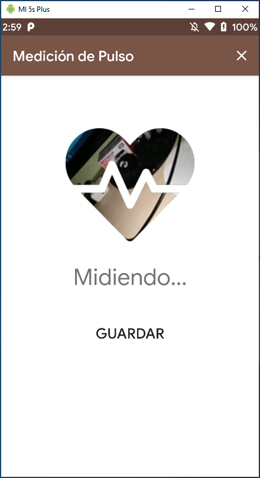</td>
        <td valign="top"><strong>Pantalla de introducción de pulso</strong> Pulsando sobre el boton <strong><i>medir con el movil</i></strong> se lanzara la siguente pantalla y se encendera el flash del telefono. 
        <small><i>(Es necesario que haya un visor de la camara, para que funcione, asi que lo he camuflado en el corazon. Además sirve para atinar donde poner el dedo)</i></small></td>
    </tr>
    <tr>
        <td>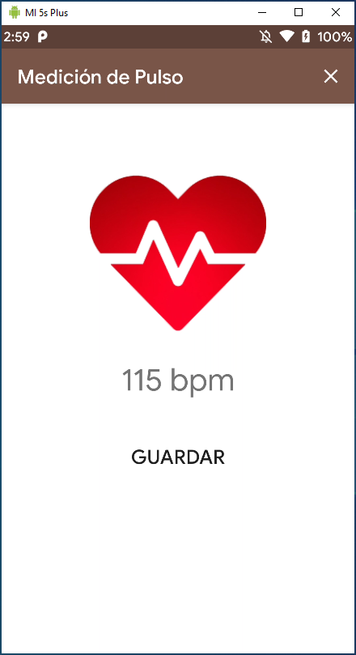</td>
        <td valign="top"><strong>Pantalla de introducción de pulso</strong> Cuando veamos que tenemos <i>"xxx bpm"</i> tras un tiempo, ya podremos darle a guardar. Voleremos a la primera pantalla, y veremos que el campo se ha rellenado automaticamente.</td>
    </tr>
    </tbody>
</table>