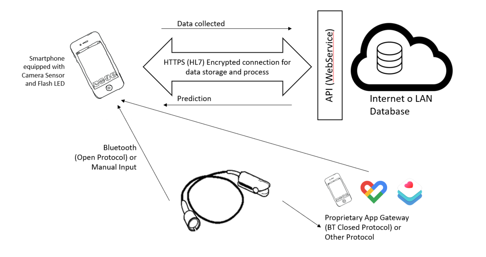
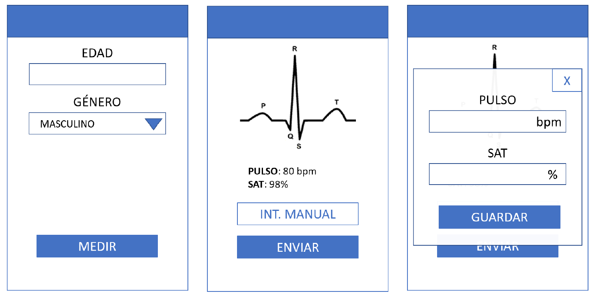

# Aplicación de monitorización de frec. Cardiaca y Saturación de oxígeno en Sangre con sensor interno y externo y con predicción de datos anómalos.

## Introducción
>Ainara Garde, al frente de un equipo de diferentes disciplinas y cuatro países, desarrolló un instrumento que permite a los trabajadores de salud de primera línea detectar rápidamente la necesidad de los niños de ser hospitalizados.Y agregan que una característica común de la mayoría de las enfermedades infantiles tratables es la falta de oxígeno.
>
>Para medir este factor de riesgo, el proyecto utilizó un sensor de dedo, el oxímetro de teléfono. De hecho, recopila datos en una aplicación de teléfono inteligente para controlar la saturación de oxígeno en la sangre y la frecuencia cardíaca de una persona. Esta información se combina con una medición de la frecuencia respiratoria.
>
>Garde desarrolló un modelo predictivo que identifica datos anormales de forma fácil y automática.
>
>[Ainara Garde](https://www.diariodenavarra.es/noticias/navarra/2017/11/27/la-investigadora-navarra-ainaragarde-premio-internacional-medicina-infantil-564133-300.html)

## Caso de Uso
El Medico quiere rápidamente hacer un análisis del estado de la frecuencia cardiaca del paciente, así como de su saturación de oxígeno, comparando las medidas con una base de datos y contrastándolo con un sistema predictivo funcionando sobre dicha base de datos.
Requisitos:
- Como Médico, quiero poder registrar la edad y el género de un paciente
- Para un paciente, quiero poder introducir variables físicas observadas durante la exploración de dicho paciente.
- Para un paciente, quiero poder realizar una medida de pulso (frecuencia cardiaca) utilizando la cámara y el flash del smartphone
- Para un paciente, quiero poder realizar una medida de saturación de oxigeno en sangre utilizando la cámara y el flash del smartphone
- En caso de resultado anómalo, para un paciente, quiero poder realizar una medida de pulso o saturación de oxigeno utilizando un equipo profesional conectado al sistema (bien sea por bluetooth, bien sea por otras tecnologías, o en última instancia por introducción manual)
- Como médico, quiero poder guardar los datos de esta exploración en un servidor para alimentar un modelo predictivo.
- Como Médico, quiero poder hacer uso de ese modelo predictivo para mostrar una valoración automática por pantalla.
- Como Medico, quiero poder acceder al mismo sistema (base de datos) desde cualquier smartphone utilizando una cuenta personal (email y contraseña).
- Como Medico, me gustaría poder utilizar la huella y demás sensores biométricos para utilizar la aplicación, sin depender de meter la contraseña cada vez.
- Como médico me gustaría descargarme un fichero Excel con las medidas realizadas en un rango de fechas, así como con su resultado calculado.
- Como médico, me gustaría corregir una predicción y así entrenar el modelo para siguientes veces.

## Arquitectura
- Elementos encontrados dentro del sistema:
    - Smartphone con cámara y flash
    - Pulsioxímetro externo
    - Servidor con Base de datos

## Modelo de Datos
### Servidor
Los requisitos de la aplicación no imponen la necesidad de mantener información identificativa del paciente, simplemente esperan del servidor una respuesta con la predicción de si las lecturas obtenidas por el sistema son anómalas o no. Por lo tanto, la información puede ser anónima.
Por cada paciente almacenara todas las mediciones de una consulta, esto es:

**ID** | **Fecha** | Genero | Edad | Pulso | Resultado | Corrección
-------| --------- | ------ | ---- | ----- | --------- | ----------

El modelo de datos en este caso se limita a una única tabla con un paciente y medición por fila.

Además, habrá que almacenar la información relativa al médico, necesaria para hacer el login. En este caso la información se presupone la mínima para que el sistema funcione:

**ID_MEDICO** | Nombre | Usuario | Contraseña | HASH 
--------------| ------ | ------- | ---------- | -----

### Cliente
El móvil no va a albergar en principio ninguna base de datos local, lo mas que vamos a tener son DTOs. La entidad puede ser “Medición” y constara de los siguientes campos:

**ID** | **Fecha** | Genero | Edad | Pulso 
-------| --------- | ------ | ---- | ----- 

## Secuencia de Interacción
- Input Manual de fuente externa
    1. Llega el paciente a la consulta.
    2. El medico enciende la app (se registra si no lo está ya)
    3. Introduce Edad y Género del paciente
    4. El paciente pone el dedo sobre la cámara y el flash y se toma la medida.
        1. Si la medida es anómala a ojos del médico.
            1. Se al pedirá al paciente que introduzca el dedo en el pulsioxímetro externo.
            2. El medico anotara en la App los datos obtenidos por el pulsioxímetro externo, en los campos destinados a tal efecto.
    5. El medico pulsa sobre enviar
    6. El servidor devuelve la información mostrando en verde si todo esta correcto, o en rojo si detecta alguna anomalía, mostrando la grafica estadística, para el posible estudio del médico.

- Input Automático/Bluetooth de fuente externa
    1. Llega el paciente a la consulta.
    2. El medico enciende la app (se registra si no lo está ya)
    3. Introduce Edad y Género del paciente
    4. El paciente pone el dedo sobre la cámara y el flash y se toma la medida.
        1. Si la medida es anómala a ojos del médico.
            1. Se al pedirá al paciente que introduzca el dedo en el pulsioxímetro externo.
            2. El medico pulsara sobre el botón “Medir Externo” en la aplicación y esperara hasta que aparezcan en pantalla los datos.
    5. El medico pulsa sobre enviar
    6. El servidor devuelve la información mostrando en verde si todo está correcto, o en rojo si detecta alguna anomalía, mostrando la gráfica estadística, para el posible estudio del médico.

## Decisiones
Visto que se trata de un escenario bastante sencillo, lo que planteo es que sea lo más versátil posible.

### Teléfono/Cliente
La programación de este sistema no es muy compleja, lo único que requiere es acceso a bajo nivel al hardware del teléfono, con lo que tendremos que ir a lenguajes de programación nativos si queremos obtener datos fiables de la cámara, puesto que necesitaremos diferencias de color en tiempo real para poder extrapolar la grafica del latido del corazón. Quedan descartadas entonces las soluciones hibridas, Cordova/PhoneGap así como las soluciones web PWA o aplicaciones progresivas en HTML5.

Para la programación nativa lo ideal será realizarla en las dos plataformas más extendidas como son Android e iOS. Sin embargo, últimamente han surgido soluciones muy interesantes por parte de Google y Facebook para facilitar la compilación a código nativo en estas dos grandes plataformas, partiendo de un único código común. Estas soluciones son Flutter y ReactNative respectivamente.

Mi propuesta inicial, y siempre y cuando estos frameworks no supongan una limitación, es utilizar Flutter para el desarrollo de la aplicación de cliente, que como ya he dicho antes se traducirá en Android/Java cuando compilemos para Android y en ObjectiveC/Swift cuando compilemos para iOS.

Flutter utiliza un lenguaje de programación de alto nivel desarrollado por Google, llamado Dart. Emplea la orientación a Objetos y es muy flexible.

### Servidor
Para la implementación en servidor se plantea el uso de Python como lenguaje de programación web. No es el mas versátil, pero si es el que mejor va a manejar todo el procesamiento de datos y ofrece la posibilidad si hiciera falta de interactuar con R en el servidor en el que decidamos desplegarlo.

Para la parte de la API, con el framework Flask, estaríamos cubiertos, puesto que no queremos mostrar nada via web, ni mostrar ningún contenido html, no necesitamos django para nada. Flask es un framwork simple que nos permitirá devolver en formato json la información para que el cliente la reciba y pinte la información en el teléfono.

Adicionalmente se propone el formato CSV para descargar el listado de las mediciones entre rangos, como se plantea en uno de los requisitos.

## Wireframe

Este es un pequeño boceto de lo que seria la interfaz principal de la aplicación móvil:

