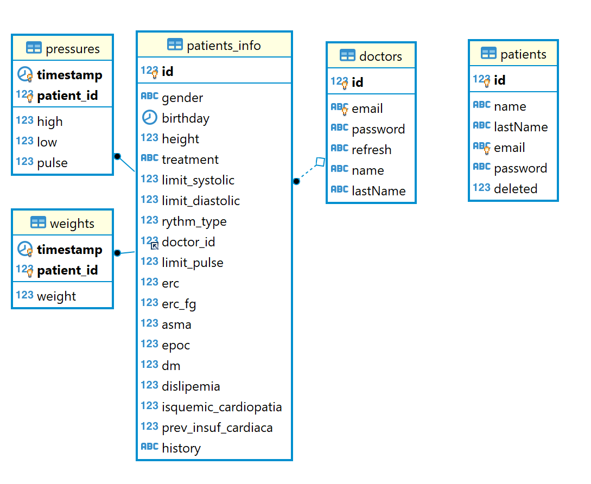

## Servidor de TensionApp
Servidor de la aplicacion de gestion de presion sanguinea y peso asi como de frecuencia cardiaca. 
Esta desarrollado en __*[Python](https://www.python.org/)*__, __*[Flask](https://www.palletsprojects.com/p/flask/)*__ y __*[SQLAlchemy](https://www.sqlalchemy.org/)*__.

El nuevo modelo de datos es este:
